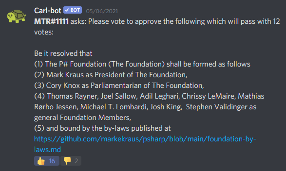
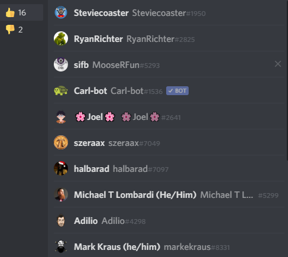
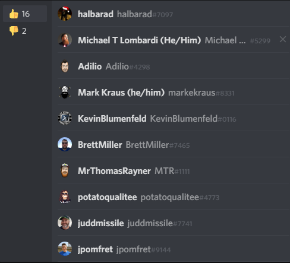

# Resolution 20210506-01

Table of Contents

- [Resolution 20210506-01](#resolution-20210506-01)
  - [Resolution Status](#resolution-status)
  - [Resolution Text](#resolution-text)
  - [Resolution Votes](#resolution-votes)
    - [Voting Class](#voting-class)
    - [Majority Requirement](#majority-requirement)
    - [Vote Date](#vote-date)
    - [Vote Type](#vote-type)
    - [Vote Mechanism](#vote-mechanism)
    - [Recorded Votes](#recorded-votes)
  - [Artifacts](#artifacts)
    - [Vote Results](#vote-results)

## Resolution Status

Resolution passed

## Resolution Text

Be it resolved that  
(1) The P# Foundation (The Foundation) shall be formed as follows  
(2) Mark Kraus as President of The Foundation,  
(3) Cory Knox as Parliamentarian of The Foundation,  
(4) Thomas Rayner, Joel Sallow, Adil Leghari, Chrissy LeMaire, Mathias Rørbo Jessen, Michael T. Lombardi, Josh King, Stephen Valdinger as general Foundation Members,  
(5) and bound by the by-laws published at [https://github.com/markekraus/psharp/blob/main/foundation-by-laws.md](https://github.com/markekraus/psharp/blob/main/foundation-by-laws.md).

## Resolution Votes

### Voting Class

This resolution was voted on with a proto-foundation of 22 people.

### Majority Requirement

To pass or fail the resolution required a simple majority of 13 votes.

### Vote Date

This vote was conducted on Thursday, May 6th, 2021.

### Vote Type

This vote was conducted publicly and unsealed.

### Vote Mechanism

Vote was cast via Discord reactions to a carl-bot post.

### Recorded Votes

| Foundation Member | Yea | Nay |
|-------------------|-----|-----|
| Stephen V.        | 1   |     |
| Ryan R.           | 1   |     |
| sifb              | 1   |     |
| Joel S.           | 1   |     |
| Devin R.          | 1   |     |
| Chris G.          | 1   |     |
| Michael L.        | 1   |     |
| Adil L.           | 1   |     |
| Mark K.           | 1   |     |
| Kevin B.          | 1   |     |
| Brett M.          | 1   |     |
| Thomas R.         | 1   |     |
| Chrissy L.        | 1   |     |
| Steven J.         | 1   |     |
| Jess P.           | 1   |     |
| Cory k.           |     | 1   |
| Yea's             | 14  |     |
| Nay's             |     | 1   |

## Artifacts

### Vote Results

Yea's:  
  

Nay's:  

